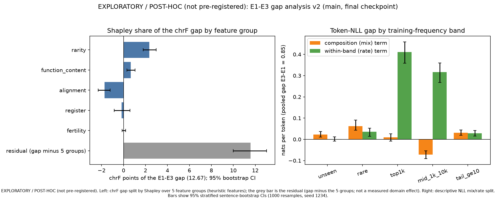

# Gap analysis v2 -- EXPLORATORY / POST-HOC (not pre-registered)

> **EXPLORATORY / POST-HOC (not pre-registered).** Post-hoc, run after the pre-registered OLS decomposition left almost all of the E1->E3 gap unexplained. The pre-registered result is cited unchanged (`reports/final/main/seg_tuned/analysis.json`, `gap_decomposition`: gap 12.67 chrF, residual 12.88). All features below are heuristics defined in `scripts/gap_v2.py` before results were inspected.

## Findings

1. EXPLORATORY / POST-HOC (not pre-registered). Main's sentence-mean chrF is 12.67 points lower on E3 than on E1 (reproduces the pre-registered gap). Under this model (OLS with a domain dummy and common slopes) the five heuristic feature groups explain about 1.1 of those points (about 9%) and the residual is about 11.6 (about 91%; its bootstrap CI upper bound is 100.8% of the gap, so it includes 100%). The residual is the gap minus the five groups, not a measured domain effect, and it depends on the model form: the same five groups explain about 31% with pooled slopes and no domain dummy, about 40% in an Oaxaca-Blinder split with E1 slopes and about -7.5% with E3 slopes (`gap_shares.json`, `estimand_sensitivity_chrf_5groups`; point estimates, no CIs). Adding a source-length control group changes the primary result little (explained 0.5 points).
2. The largest positive group is target-side rarity (about +2.3 points, CI in Table 1). The alignment group is negative (about -1.7): E1 has more extreme source/reference length ratios than E3 (4.0% vs 2.4% moderate, 1.2% vs 0.6% severe), so on these features alone E1 would be expected to score lower, which works against the gap. Function/content mix, register markers and subword fertility are each small or indistinguishable from zero (see CIs). The Shapley shares are order-invariant but inherit the linear, common-slope form of the model.
3. Model-side view (teacher-forced NLL of the reference, a different quantity from chrF): pooled NLL is 1.84 nats per token on E1 and 2.68 on E3. The frequency bands are over SUBWORD tokens: unseen, rare (<10) or tail-ge10 subword tokens are 2.6% of E3 tokens (0.2% of E1) and carry about 21% of the pooled-token NLL gap, so the gap is not concentrated in rare subword tokens (about 79% sits in the top-1k and 1k-10k subword bands, mostly as within-band increases). At the WORD level the picture is different: unseen, rare or tail-ge10 words are 17.1% of E3 reference word tokens vs 8.5% of E1 (`features_summary.json`, `word_token_share_unseen_rare_tail`), so E3 does contain more novel vocabulary; this analysis does not show how much of the NLL gap that accounts for. Why frequent subwords get higher NLL on E3 is not tested here.
4. E3 is more dialogue- and pronoun-heavy (23% of sources start with a dash or quote vs 5%; reference quote density about 11x), and its French source has higher subword fertility (1.71 vs train 1.54 tokens per word, reproduced here on the source side; English references 1.55 vs train 1.47). These are heuristics; they differ between the sets but account for little of the chrF gap in this model.
5. What the residual consists of cannot be told from these data: candidates (not tested) include literary-register and archaic-vocabulary difficulty beyond the measured proxies, looser free translations in the E3 references (single reference, chrF), and the linear common-slope form itself. Only one model (main, step 24,645), two outcomes (chrF, NLL) and one reference per sentence are used, so nothing here is a causal claim.
6. Collinearity is mild (max VIF 4.5, condition number about 5 on standardised features); no group is near-collinear with the domain dummy (a single group predicts the E3 indicator with R^2 at most 0.11), see `collinearity.json`. The second outcome (sentence-mean NLL) is summarised below the tables.

## Table 1 -- Shapley share of the E1-E3 chrF gap (EXPLORATORY / POST-HOC (not pre-registered))

Gap = mean sentence chrF(E1) - mean sentence chrF(E3) = 12.67 (n = 1940 + 1000). Share = Shapley value of the group's mean-difference contribution b_k * (xbar_E1 - xbar_E3) in OLS with a domain dummy (exact over all 2^5 subsets); the groups' contributions plus the residual sum to the gap exactly. 95% CIs: 1000 stratified sentence-bootstrap refits, seed 1234.

| group | chrF points [95% CI] | share of gap [95% CI] | Shapley R^2 [95% CI] |
|---|---|---|---|
| rarity | +2.34 [+1.80, +2.99] | +18.5% [+14.0, +23.8] | 0.0401 [0.0321, 0.0535] |
| function_content | +0.66 [+0.31, +1.05] | +5.2% [+2.5, +8.5] | 0.0103 [0.0050, 0.0193] |
| alignment | -1.74 [-2.31, -1.23] | -13.7% [-19.1, -9.2] | 0.0950 [0.0741, 0.1156] |
| register | -0.17 [-0.86, +0.59] | -1.3% [-7.1, +4.6] | 0.0119 [0.0062, 0.0251] |
| fertility | +0.01 [-0.12, +0.20] | +0.1% [-0.9, +1.6] | 0.0008 [0.0004, 0.0052] |
| **explained (all groups)** | +1.10 | +8.7% | R^2 0.2297 (domain-only 0.0716) |
| **unexplained residual (= gap minus the five groups; includes the domain-dummy coefficient; not a measured domain effect)** | +11.57 [+10.00, +13.03] | +91.3% [+82.7, +100.8] | - |

Sensitivity (adds a `length` control group, log source words; not part of (a)-(e)): explained +0.50 chrF (+3.9%), residual +12.17 [+10.60, +13.65]; length -0.58 [-0.86, -0.35].

Residual note: residual = gap minus the explained part of the five groups (= -coefficient of the domain dummy in the primary OLS); it is NOT a measured domain effect and depends on the model form

Estimand sensitivity (`gap_shares.json`, `estimand_sensitivity_chrf_5groups`; explained share of the 12.67 chrF gap by all five groups together, point estimates): pooled OLS with domain dummy (primary form) +8.7%, pooled OLS without domain dummy +31.4%, Oaxaca-Blinder with E1 slopes +40.5%, with E3 slopes -7.5%. The unexplained share is therefore model-dependent; the 91% figure holds only for the primary form, and its bootstrap CI upper bound is 100.8% (residual share CI includes 100%).

Second outcome (`second_outcome_nll_5groups`, sentence-MEAN NLL, a different unit from the pooled-token NLL gap in Table 2): the sentence-mean NLL gap E1-E3 is -0.69; the five groups explain -0.03 and the residual is -0.66 (95.4% of that gap). The pooled-token gap in Table 2 is +0.846 nats (E3-E1, tokens weighted equally rather than sentences).

## Table 2 -- Token NLL by training-frequency band (EXPLORATORY / POST-HOC (not pre-registered))

Teacher-forced NLL of the reference (fp32, eval mode, no label smoothing, EOS excluded). Pooled token gap E3-E1 = 0.846 nats (mix + rate terms sum to it exactly).

| band | token share E1 | token share E3 | mean NLL E1 | mean NLL E3 | mix term | rate term |
|---|---|---|---|---|---|---|
| unseen | 0.0% | 0.3% | 9.38 | 9.73 | +0.023 | +0.001 |
| rare | 0.1% | 1.3% | 5.06 | 7.81 | +0.062 | +0.036 |
| top1k | 68.0% | 68.6% | 1.56 | 2.16 | +0.009 | +0.411 |
| mid_1k_10k | 31.8% | 28.8% | 2.42 | 3.52 | -0.072 | +0.316 |
| tail_ge10 | 0.1% | 1.0% | 3.38 | 6.13 | +0.031 | +0.029 |

Bands in Table 2 are over SUBWORD tokens. Share of reference tokens that are unseen, rare or tail-ge10 in the training English side (`features_summary.json`, `target_novelty_and_bands.by_domain`): subword tokens E1 0.2% vs E3 2.6%; WORD tokens E1 8.5% vs E3 17.1%.

## Figure (EXPLORATORY / POST-HOC (not pre-registered))

*EXPLORATORY / POST-HOC (not pre-registered).* Left: Shapley contribution of each feature group to the chrF gap with 95% bootstrap CIs; the grey bar is the residual (gap minus the five groups; not a measured domain effect). Right: descriptive split of the pooled token-NLL gap by training-frequency band.

## Files

`features_summary.json` (feature means/sd per domain, novelty, fertility, alignment, word lists), `nll_breakdown.json`, `gap_shares.json`, `ols_hc3.json`, `collinearity.json`, `provenance.json`. All carry the key `label`.

## Provenance

- code commit (the commit the numbers were generated from): `ec1b029d1ad92966af0b129dce54a263a812de3c` (tree dirty: False)
- eval repo `OWNER/fr-en-transformer-eval` @ `c3d8598252853fcd7df1ef4a00e8b0382b8f4351` (private=True, manifest sha256 `613ea8c0d2e22958e6ef5fc55fe63c8d8f6c218c63958ed5edeb5b33b5ca37d1`, model files verified: True)
- data repo `OWNER/fr-en-transformer-data` @ `c40e393740f41dd3aac3e615952ac7b86d4e58e0` (private=True; shard + spm sha256 verified against `data/shards/manifest.json`)
- word list sha256 `ce42d239b492e7830b20dde1fd8c0d712dffeb9526abc9b81a66bc702c58fa5d`; runtime {'verify': 0.01, 'data_chrf': 7.78, 'train_counts': 23.21, 'features': 1.55, 'nll': 56.6, 'nll_breakdown': 1.34, 'decomposition': 272.31, 'total': 361.87}
- input file sha256 values: `provenance.json` (`input_files_sha256`, `eval_model_sha256`, `data_repo_files_sha256`)
- line endings: LF (files are written as bytes)
